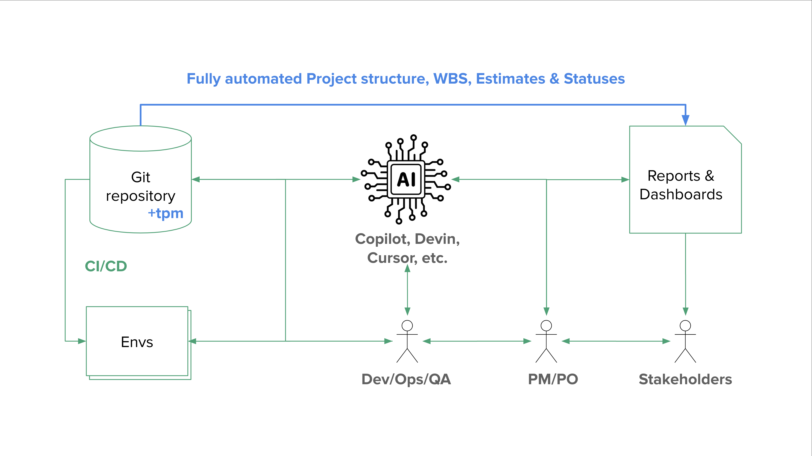
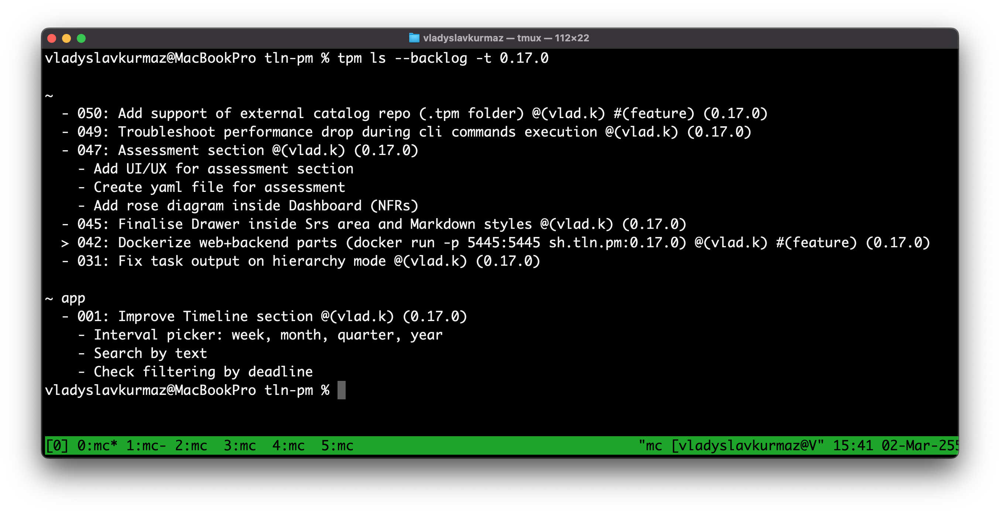
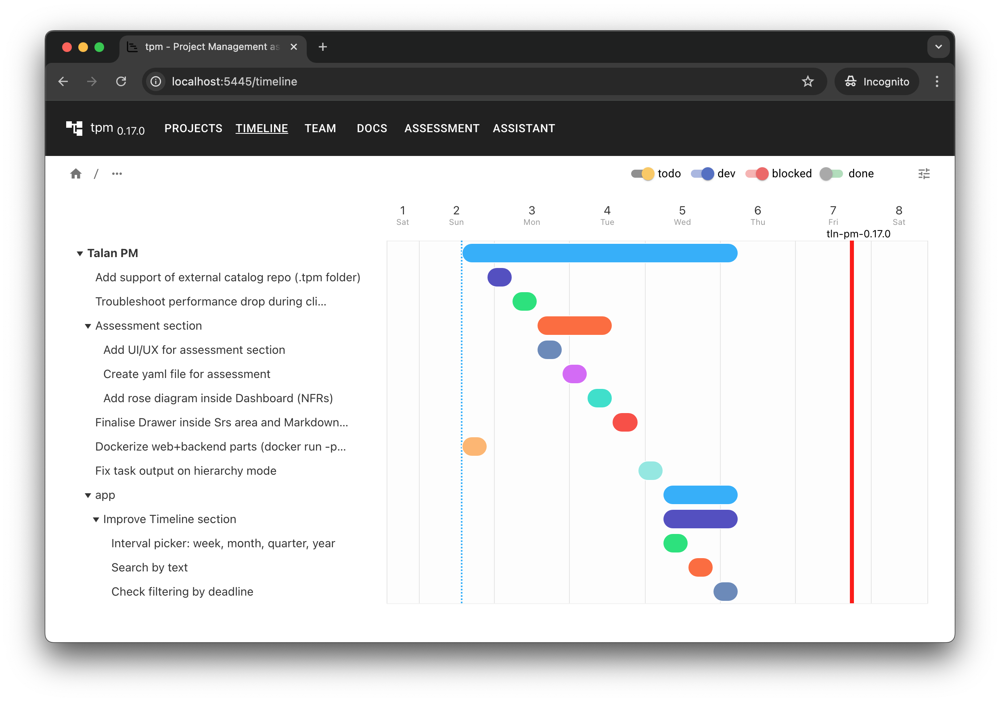
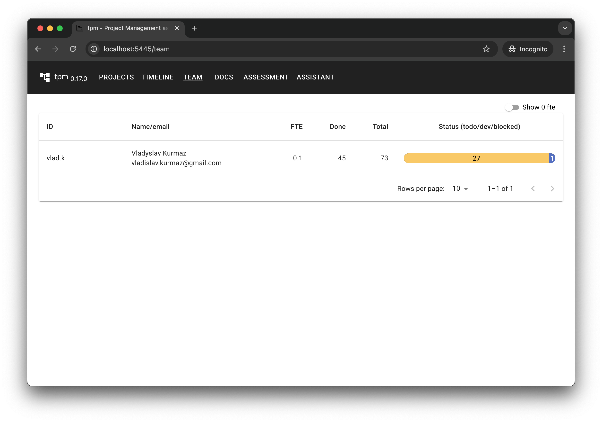
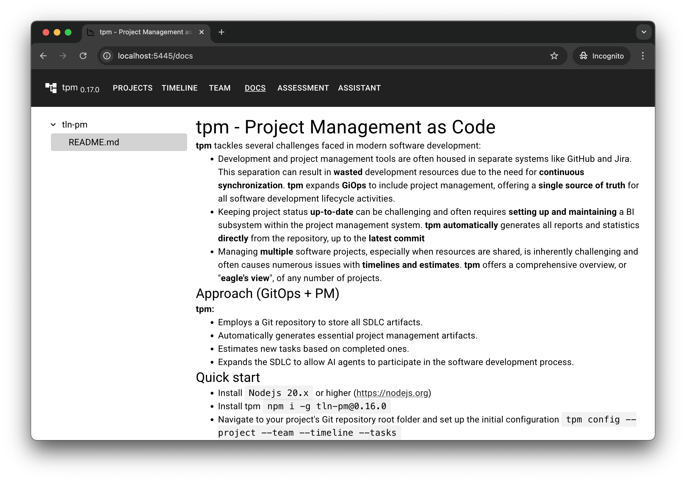

# tpm - Project Management as Code
**tpm** tackles several challenges faced in modern software development:
  * Development and project management tools are often housed in separate systems like GitHub and Jira. This separation can result in **wasted** development resources due to the need for **continuous synchronization**. **tpm** expands **GitOps** to include project management, offering a **single source of truth** for all software development lifecycle activities.
  * Keeping project status **up-to-date** can be challenging and often requires **setting up and maintaining** a BI subsystem within the project management system. **tpm** **automatically** generates all reports and statistics **directly** from the repository, up to the **latest commit**
  * Managing **multiple** software projects, especially when resources are shared, is inherently challenging and often causes numerous issues with **timelines and estimates**. **tpm** offers a comprehensive overview, or "**eagle's view**", of any number of projects.


## Approach (GitOps + PM)
**tpm:**
- Employs a Git repository to store all SDLC artifacts.
- Automatically generates essential project management artifacts.
- Estimates new tasks based on completed ones.
- Expands the SDLC to allow AI agents to participate in the software development process.


|||
| --- | --- |
|||
|||
|| |

## Demo project
* Run next docker command to see tpm in action using test project
  ```
  docker run -it -p 5445:5445 --rm vladyslavkurmaz/sh.tln.pm:0.17.0
  ```
* Open next link in browser
  ```
  http://localhosy:5445
  ```

## Quick start

* Install `Nodejs 20.x` or higher (https://nodejs.org)
* Install tpm
  ```
  npm i -g tln-pm@0.17.0
  ```
* Navigate to your project's Git repository root folder and set up the initial configuration
  ```
  tpm config --project --team --timeline --tasks
  ```
* Update **.tpm.yml** with your project's details, including team structure, fte, timeline, and tasks. Ensure that the emails used for **tpm** configuration match toyr dev team emails.
  ```
  project:
    id: myproject
    name: My Project
    description: My project description
  team:
    alice.c:
      email: alice.c@gmail.com
      name: Alice Clarke
      fte: 1
  timeline:
    25.2.0:
      deadline: '2025-02-28T18:00:00.000Z'
  tasks: |
    [>:002:25.2.0] Integrate auth library @alice.c
      [!] Add /iam/auth endpoint #16h
      [>] Configure auth callbacks #4h
    [-:001:25.2.0] Create project structure #16h @alice.c
  ```
* Now you can start managing your project using cli and git
  | Command | Description |
  | ------------- | -------------
  | tpm ls --backlog | Display tasks are in backlog for current git user (you) |
  | tpm ls -g alice.c | Display tasks in development were assigned to the Alice |
  | tpm ls -g alice.c --backlog | List of tasks are in Alice backlog |
* The following command will provide a high-level "eagle view" of your project in the browser **http://localhost:5445**
  ```
  tpm serve
  ```

## Task statuses & attributes
  * Task can be described in multiple forms depends on requirements
    | Example  | Description |
    | ------------- | ------------- |
    | [-] Simple task with description only | This format is useful for subtasks |
    | [-:001] Task with Id | Top level task but without delivery version |
    | [-:010:25.2.0] Task with delivery version | This format should be used for top level task with specific deadline |
  
  * First symbol in square brackets describes status of the task
    | Symbol | Meaning         |
    | ---    | ---             |
    | -      | todo            |
    | >      | in development  |
    | !      | blocked         |
    | +      | done            |

## Mentionings, Tags, Links
  * @alex.m - will bind Alex with specfic task
  * #backend - will add `backend` tag to the task
  * #16h - will define estimate for the task

## Command line options
General format
```
tpm [ls | config] [component] [id] [optios]
```
| Command (parameters & options)  | Default | Description |
| ------------- | ------------- | ------------- |
| tpm ls | | Display list of tasks for current git user |
| tpm config --project --team --timeline --tasks --doc --components | | Generate example .tpm.yml |
| tpm ls --backlog | false | Display list of tasks for current git user are waiting for completion |
| tpm ls --todo | false | Display list of tasks for current git user in development |
| tpm ls --dev | true | Display list of tasks for current git user in development |
| tpm ls --done | true | Display list of tasks for current git user which were aleady completed |
| tpm ls -g alice.c | git user |  Display tasks in developmenr were assigned to the specific user |
| tpm ls -a | false | Display tasks are in development for all users |
| tpm ls -t backend | | Display tasks with 'backend' tag |
| tpm ls -s cognito | | Display tasks with 'cognito' string in title |

## DSL
```
project:
  id: myproject
  name: My Project
  description: My project description
team:
  alice.c:
    email: alice.c@gmail.com
    name: Alice Clarke
    fte: 1
timeline:
  25.1.0:
    deadline: '2025-01-31T18:00:00.000Z'
tasks: |
  [>:002:25.1.0] Integrate auth library @alice.c
    [!] Add /iam/auth endpoint
    [>] Configure auth callbacks
  [-:001:25.1.0] Create project structure @alice.c
components:
  backend:
    tasks: |
      [-:002] Integrate Sonarcloud
      [+:001] Add service skeleton + unit tests
  web:
    tasks: |
      [-:002] Integrate Sonarcloud
      [>:001] Add landing skeleton using Next.js
```  
